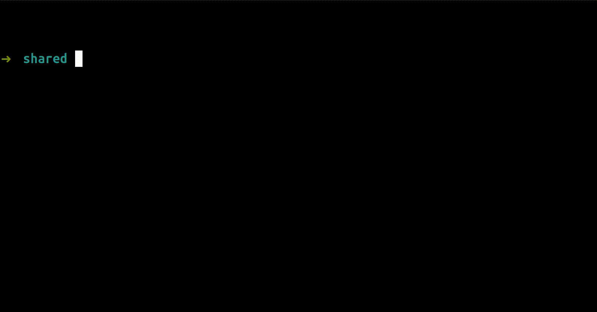

# qs

Quickly share any media to Imgur via a shell script — keeping you as anonymous as possible.



## Features

- Removes metadata before uploading
- Tracks all uploaded media 
- Pastes to a clipboard + OS notifications

## Requirements

- OS Linux/MacOS
- [curl](https://curl.se/)
- [jq](https://github.com/jqlang/jq)
- [exiftool](https://exiftool.org/)

## Setup

1. Install in `$HOME/.qs`

   ```shell
   curl -sL https://raw.githubusercontent.com/roboloop/qs/refs/heads/main/install.sh | bash
   ```

2. Make the program globally accessible by adding to the corresponding command to the shell-config

   ```shell
   export PATH="$HOME/.qs:$PATH"`
   ```

## Usage

```shell
Usage:

  qs <command> [arguments]

The commands are:

  upload      uploads media (filepath, url, or stdin media is accepted)
    --no-copy to skip copying the result link
  delete      deletes all media files
  list        prints all uploaded media

Other environments:

  IMGUR_CLIENT_ID   overrides client_id

Examples:

  qs upload '/user/media/example.jpeg'   # Upload example.jpeg to Imgur
  qs delete                              # Removes all uploaded media
  qs list                                # Prints all uploaded media
```
